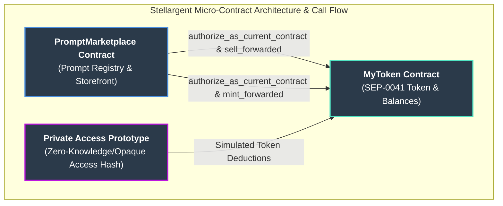

# Stellargent - Decentralized AI Prompt Marketplace on Stellar

[](https://www.rust-lang.org/)
[](https://soroban.stellar.org/)
[](LICENSE)
[](https://github.com/StellarXagent/StellarXagent-contracts-v2/actions)

Stellargent is a decentralized smart contract system designed to power a secure, tokenized marketplace for AI prompts on the Stellar blockchain using Soroban and Rust. The project enables creators and users to exchange high-value AI prompts while maintaining control over digital assets, privacy, and economic models. Built specifically for AI researchers, prompt engineers, and users transitioning to web3-based digital asset economies.

The platform provides a comprehensive solution for modern AI prompt tokenization, combining the security benefits of blockchain technology with practical marketplace workflows. It features a custom SEP-0041 compliant fungible token tightly integrated with a prompt storefront.

---

## Table of Contents

- [Project Overview](#-project-overview)
- [Setup Instructions](#-setup-instructions)
  - [Prerequisites](#-prerequisites)
  - [Quick Start](#-quick-start)
  - [Environment Setup](#-environment-setup)
  - [Running Tests](#-running-tests)
  - [Network Configuration](#-network-configuration)
- [Features](#-features)
- [Micro-Contract Architecture](#-micro-contract-architecture)
- [Project Structure](#-project-structure)
- [Usage Examples](#-usage-examples)
- [Deployment](#-deployment)
- [CI/CD Pipeline](#-cicd-pipeline)
- [Helpful Links](#-helpful-links)
- [Contribution Guidelines](#-contribution-guidelines)
- [License](#-license)
- [Support](#-support)

---

## Project Overview

Stellargent transforms the AI prompt economy by leveraging Stellar's blockchain infrastructure to create an immutable, secure, and creator-centric ecosystem. The system addresses critical digital asset challenges including payment settlement, ownership tracking, and privacy through cryptographic security.

### Key Benefits

| Benefit | Description |
|---------|-------------|
| **Cross-Contract Security** | Strict authorization bounding between Marketplace and Token contracts |
| **Creator Control** | Admins and creators govern prompt pricing and token supply |
| **Interoperability** | Built on SEP-0041 standard for seamless ecosystem integration |
| **Privacy Exploration** | Experimental off-chain SHA-256 hash architecture for private access |
| **AI-Specific** | Tailored specifically for prompt engineers and AI asset trading |

### Target Users

- Prompt engineers and AI researchers
- Digital asset marketplaces and platforms
- Users seeking privacy-preserving access to premium AI models
- Web3 developers building on Stellar

---

## Setup Instructions

### Prerequisites

Before you begin, ensure you have the following installed:

- **Rust 1.78.0+** - [Install Rust](https://www.rust-lang.org/tools/install)
- **Soroban CLI v26.1.0+** - [Install Soroban](https://soroban.stellar.org/docs/getting-started/installation)
- **Git** - For version control
- **Make** - For using the provided Makefile

### Quick Start

Get up and running in under 5 minutes:

```bash
# Clone the repository
git clone https://github.com/StellarXagent/StellarXagent-contracts-v2.git
cd Smart-contracts

# Or use the Makefile for step-by-step setup
make setup
```

### Environment Setup

#### Manual Setup

```bash
# Install Rust targets and components
rustup target add wasm32v1-none
rustup component add rustfmt clippy rust-src

# Export Spec Shaking flag required for v25+
export SOROBAN_SDK_BUILD_SYSTEM_SUPPORTS_SPEC_SHAKING_V2=1

# Configure Soroban for Testnet
soroban config network add testnet \
    --rpc-url https://soroban-testnet.stellar.org:443 \
    --network-passphrase "Test SDF Network ; September 2015"

# Build the project
cargo build --target wasm32v1-none --release
```

### Running Tests

Ensure everything is working correctly across the workspace (58 tests in total):

```bash
# Run all tests (macOS/Linux examples)
SOROBAN_SDK_BUILD_SYSTEM_SUPPORTS_SPEC_SHAKING_V2=1 cargo test --workspace --target aarch64-apple-darwin

# Run specific package tests
SOROBAN_SDK_BUILD_SYSTEM_SUPPORTS_SPEC_SHAKING_V2=1 cargo test -p my-token --target aarch64-apple-darwin
SOROBAN_SDK_BUILD_SYSTEM_SUPPORTS_SPEC_SHAKING_V2=1 cargo test -p prompt-marketplace --target aarch64-apple-darwin
```
> **Note:** The default workspace target (`.cargo/config.toml`) is `wasm32v1-none`, which does not support `cargo test`. You must explicitly pass a native target (e.g., `x86_64-unknown-linux-gnu` or `aarch64-apple-darwin`).

### Network Configuration

The project supports multiple Stellar networks:

```bash
# Set up a deployer identity
soroban config identity generate deployer

# Fund the account on Testnet (use Stellar Laboratory)
```

---

## Features

- **MyToken (SEP-0041):** Fungible token with owner-governed minting, burning via sell, and pausable functionality.
- **PromptMarketplace:** Storefront where admins register prompts and users purchase them (burning tokens).
- **Private Access Prototype:** Uses off-chain SHA-256 hashes instead of plaintext IDs to hide prompt ownership on the public ledger.
- **Secure Cross-Contract Auth:** Specialized `set_marketplace` binding ensures the token only alters balances when authorized by the exact connected marketplace.
- **Mainnet Ready:** Full deployment scripts with multi-sig and hardware wallet considerations.

---

## Micro-Contract Architecture

The following diagram details the dependency graph and cross-contract call flow between the core components:



*Note on Soroban v25 Auth:* Soroban v25's mock auth cannot satisfy a second `require_auth()` for the same address within a single invocation tree. Therefore, `sell_forwarded` and `mint_forwarded` strictly rely on the marketplace Wasm authorization (`authorize_as_current_contract`), rejecting any direct account external calls to those endpoints.

---

## Project Structure

```
contracts/
├── tokens/                      # MyToken (fungible token)
│   ├── Cargo.toml
│   └── src/
│       ├── lib.rs               # module exports, public re-export
│       ├── contract.rs          # #[contract] MyToken — public API + traits
│       ├── events.rs            # #[contractevent] structs (MintEvent, SellEvent, etc.)
│       ├── core/
│       │   └── token.rs         # TokenManager — business logic
│       ├── storage/
│       │   └── types.rs         # DataKey, contracttype structs
│       └── tests.rs             # 21 tests
└── marketplace/                 # PromptMarketplace
    ├── Cargo.toml
    └── src/
        ├── lib.rs               # module exports
        ├── contract.rs          # #[contract] PromptMarketplace — public API
        ├── storage/
        │   └── types.rs         # DataKey, Prompt struct, errors
        └── tests.rs             # 36 tests
Cargo.toml                       # workspace: tokens + marketplace
```

---

## Usage Examples

### Basic Contract Interaction

```bash
# Read token name
stellar contract invoke --source default --network testnet \
  --id <TOKEN_ID> \
  -- name

# Register prompt
stellar contract invoke --source default --network testnet \
  --id <MARKETPLACE_ID> \
  --send=yes \
  -- register_prompt --prompt_id "alpha" --price 500 \
  --owner "$(stellar keys address default)"

# Query price
stellar contract invoke --source default --network testnet \
  --id <MARKETPLACE_ID> \
  -- get_price --prompt_id "alpha"
```

---

## Deployment

### Local Development / Testnet

```bash
# 1. Deploy Token
stellar contract deploy \
  --wasm target/wasm32v1-none/release/my_token.wasm \
  --source default --network testnet --alias my_token \
  -- --owner "$(stellar keys address default)" --name "PromptToken" --symbol "PRMPT" --decimals 7

# 2. Deploy Marketplace
stellar contract deploy \
  --wasm target/wasm32v1-none/release/prompt_marketplace.wasm \
  --source default --network testnet --alias prompt_marketplace \
  -- --admin "$(stellar keys address default)" --token "$TOKEN_ID"

# 3. Bind token -> marketplace (Required for cross-contract auth)
stellar contract invoke \
  --id "$TOKEN_ID" --source default --network testnet --send=yes \
  -- set_marketplace --marketplace "$MARKETPLACE_ID"
```

### Production Mainnet Deployment

> ⚠️ **SECURITY WARNING:** Do not hardcode private keys. Use a secrets manager. Prefer multisig accounts or hardware wallets for the admin account.

```bash
# Build release, calculate hashes, deploy, initialize, and validate both contracts
MAINNET_DEPLOYER_SOURCE="deployer" \
MAINNET_ADMIN_SOURCE="admin" \
MAINNET_ADMIN_ADDR="G..." \
bash scripts/deploy-mainnet.sh
```

---

## CI/CD Pipeline

### Scripts & Workflows

| Script | Purpose |
|----------|---------|
| `scripts/deploy-mainnet.sh` | Mainnet deploy with Hash verification and JSON output |
| `scripts/verify-mainnet.sh` | Verify live contracts against local artifacts without re-deploying |
| `scripts/integration-test.sh` | Full E2E Testnet flow with Soroban CLI |

---

## Helpful Links

### Documentation

- [Threat Model & Privacy](docs/adr/0001-private-access-threat-model.md)
- [Market V1 Settlement](docs/adr/0002-market-v1-settlement-and-creator-payout.md)
- [Mainnet Custody Policy](docs/security/MAINNET_CUSTODY_POLICY.md)
- [Audit Process](docs/security/AUDIT_PROCESS.md)
- [Incident Response](docs/operations/MONITORING_AND_INCIDENT_RESPONSE.md)

### External Resources

- [Stellar Developer Docs](https://developers.stellar.org/)
- [Soroban Documentation](https://soroban.stellar.org/docs)
- [Rust Documentation](https://doc.rust-lang.org/)

---

## Contribution Guidelines

We welcome contributions! Please follow these guidelines:

1. **Fork** the repository
2. **Clone** your fork locally
3. **Create** a feature branch: `git checkout -b feature/your-feature`
4. **Make** your changes
5. **Test** your changes using the workspace testing instructions
6. **Commit** with a descriptive message
7. **Push** to your fork
8. **Submit** a Pull Request

---

## License

This project is licensed under the MIT License.

---

## Support

- **Issues**: [GitHub Issues](https://github.com/StellarXagent/StellarXagent-contracts-v2/issues)
- **Discussions**: [GitHub Discussions](https://github.com/StellarXagent/StellarXagent-contracts-v2/discussions)

---

<p align="center">
  Built with Soroban on Stellar
</p>
